The theme applies Northwestern colors to [Mermaid](https://mermaid.js.org/) diagrams and adds a fullscreen viewer with pan/zoom, SVG download, source copying, and touch support. Hover any diagram below to see the toolbar.

See [Getting Started](/getting-started/#mermaid-diagrams-optional) for setup instructions.

## Flowchart

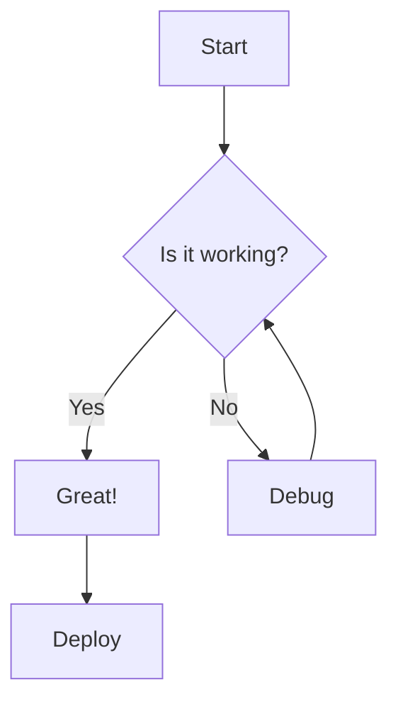

## Sequence Diagram

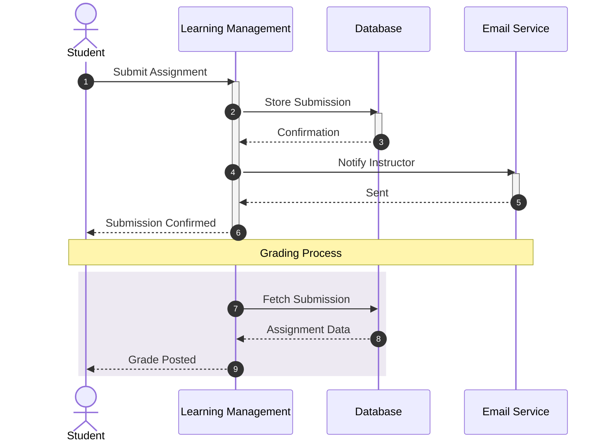

## Class Diagram

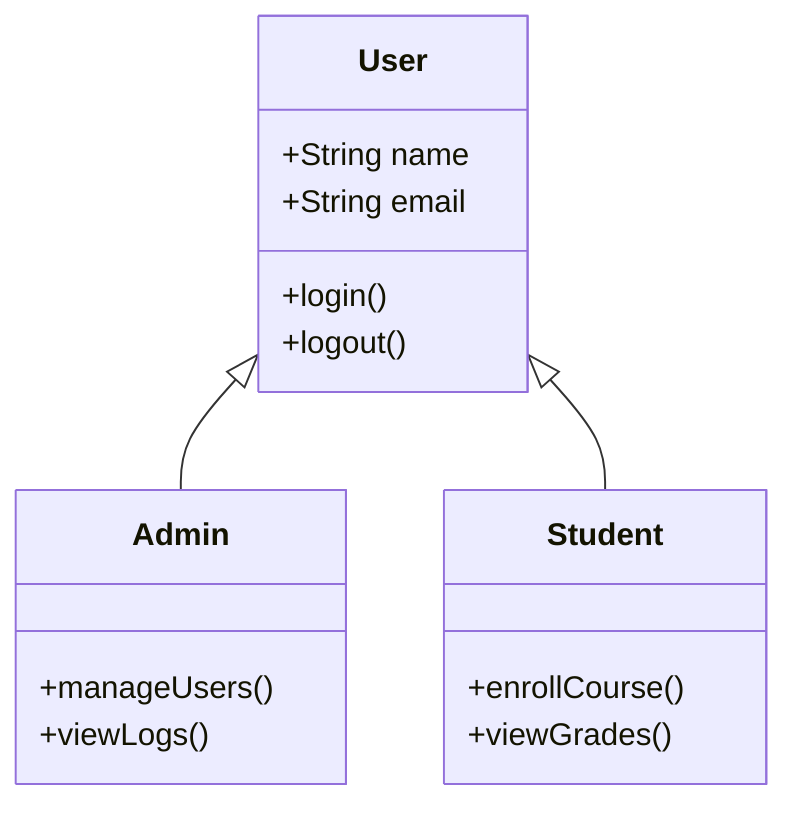

## State Diagram

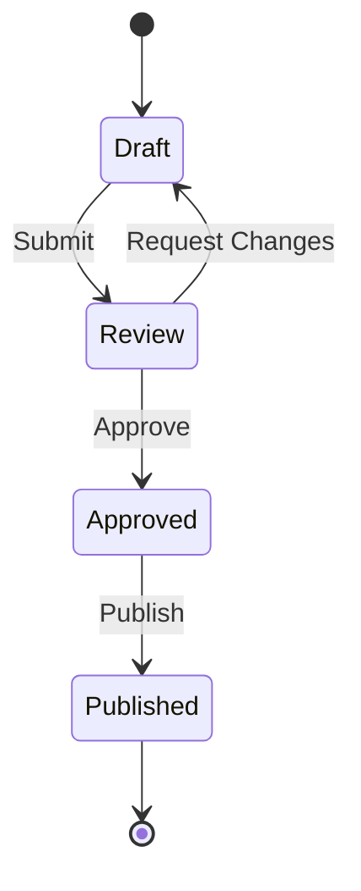

## Entity Relationship Diagram

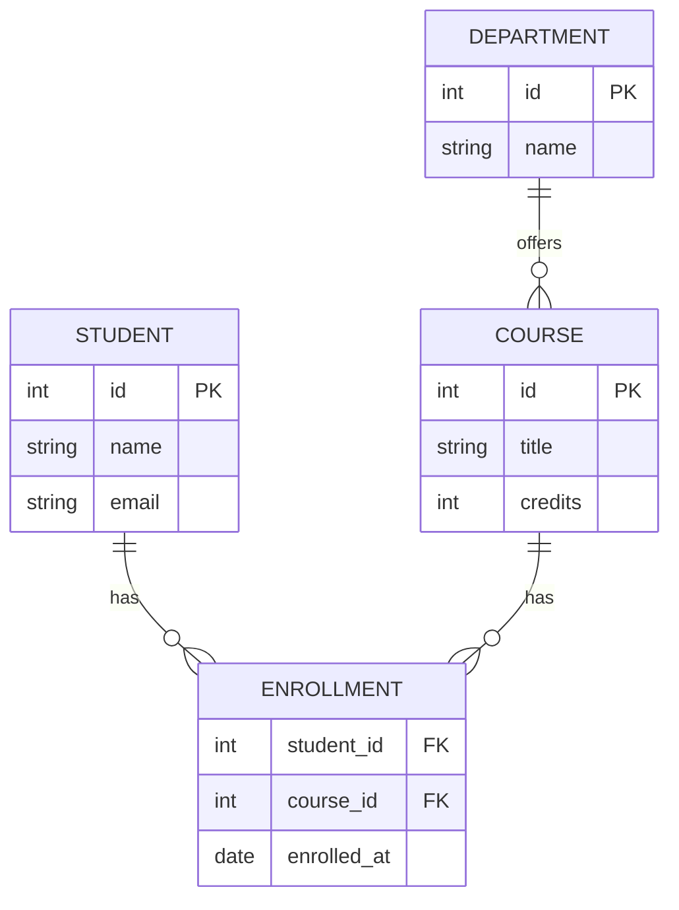

## Gantt Chart

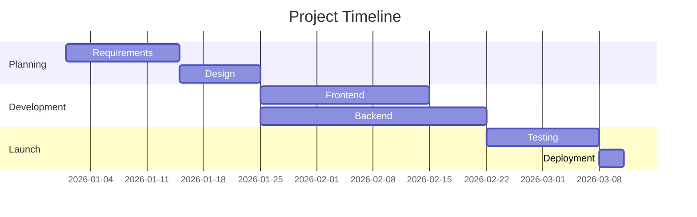

## Pie Chart

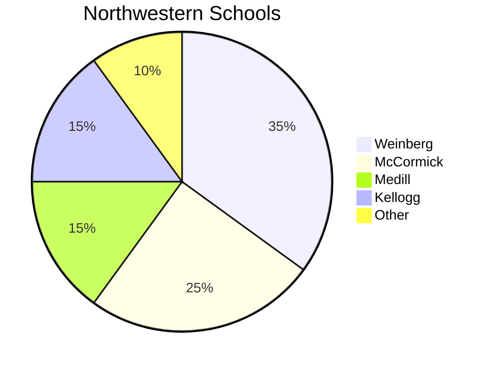

## Git Graph

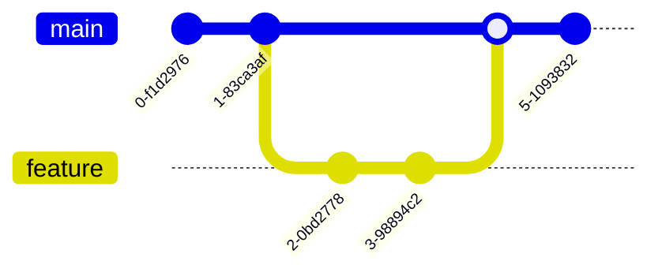

## Mindmap

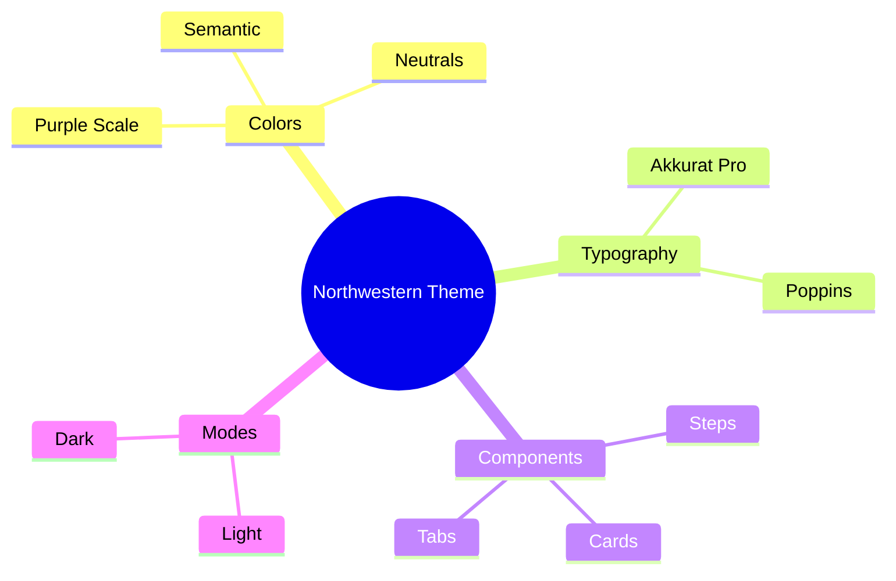

## Timeline

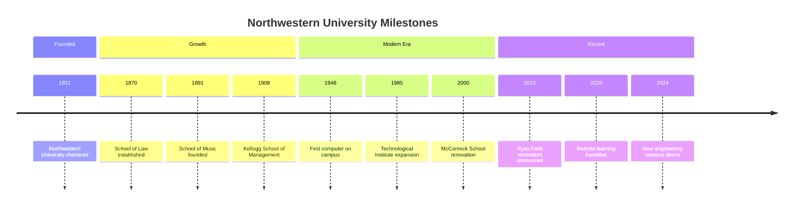

## Quadrant Chart

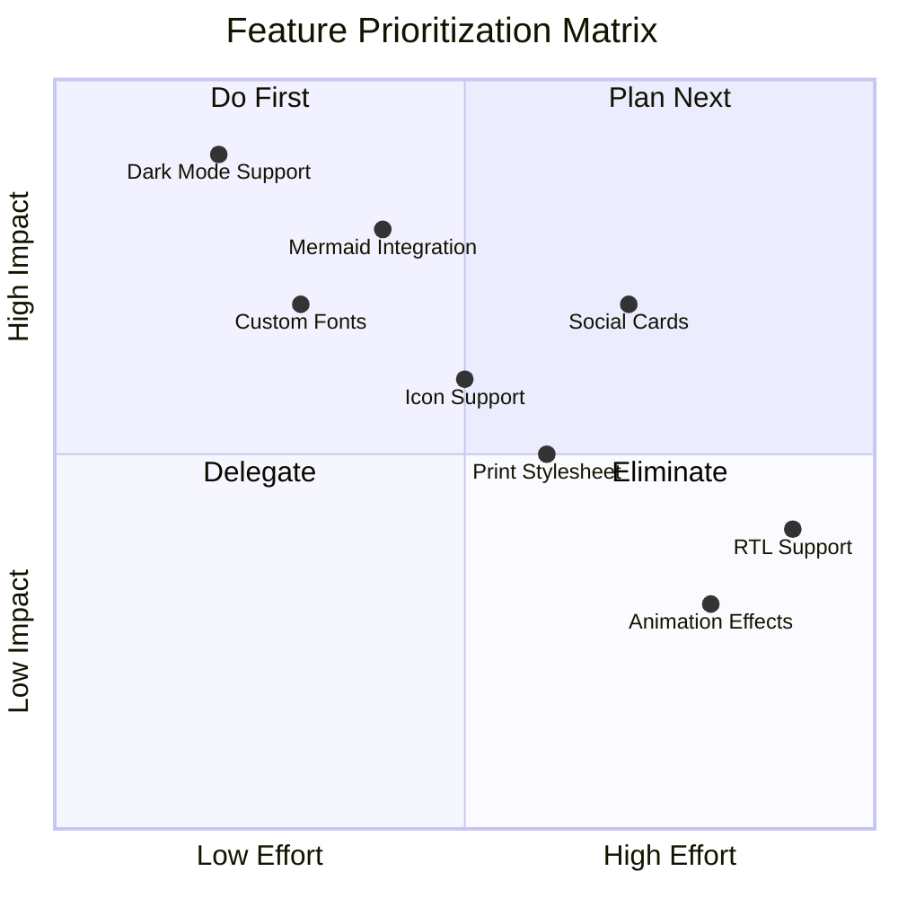

## XY Chart — Bar and Line

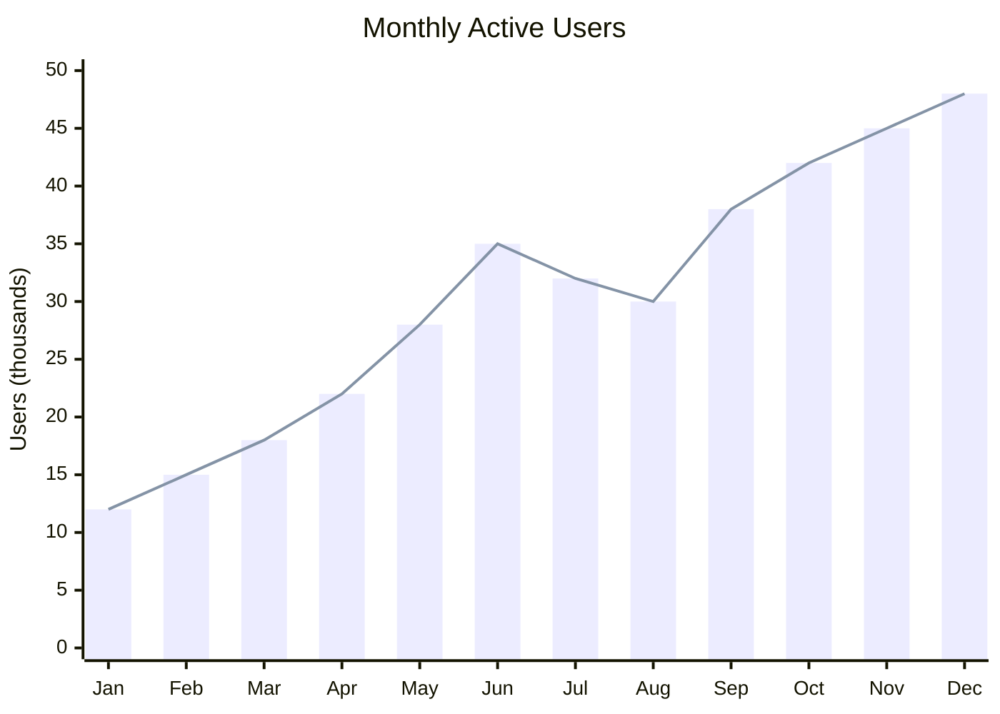
