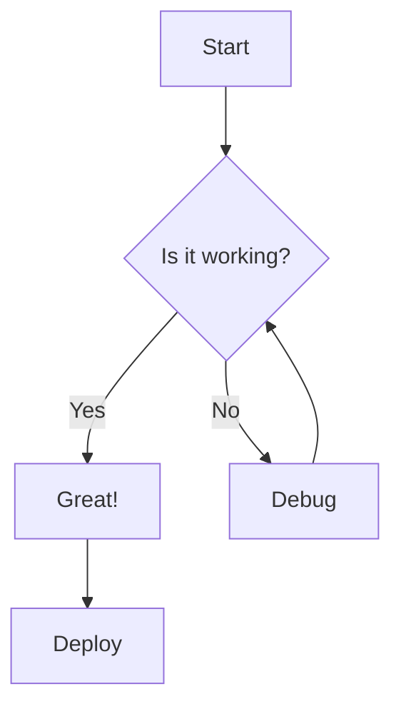
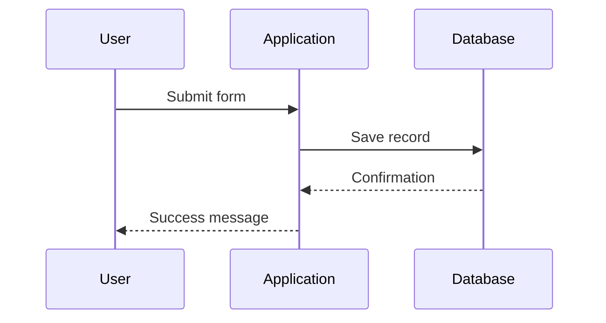
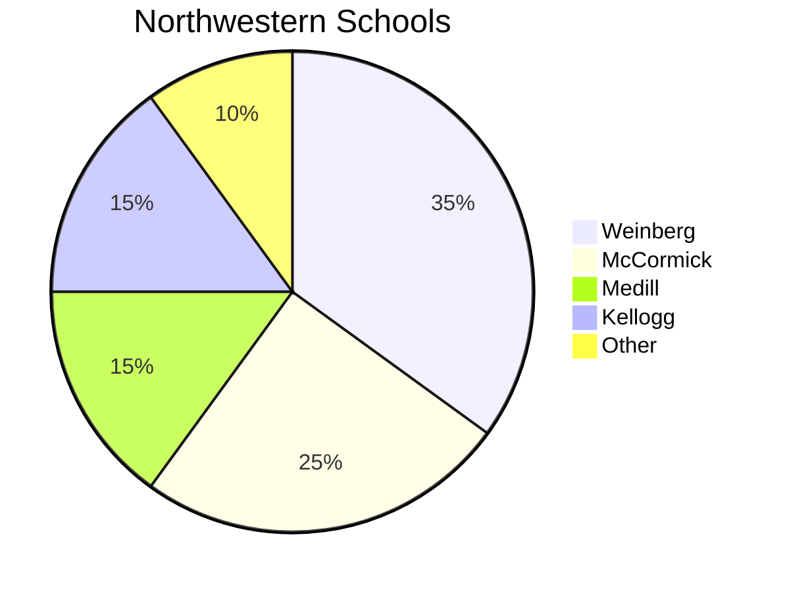

import { Aside, Badge, Card, CardGrid, FileTree, LinkButton, LinkCard, Steps, Tabs, TabItem } from "@astrojs/starlight/components";
import { PackageManagers } from "starlight-package-managers";

## Typography

### Headings

Headings use **Poppins** (H1, H2) and **Akkurat Pro** (H3-H6) from the Northwestern CDN.

#### Fourth Level

Content below an h4 heading.

##### Fifth Level

Content below an h5 heading.

###### Sixth Level

Content below an h6 heading.

#### A Heading That Wraps to Multiple Lines Because the Title Describes a Complex Configuration Scenario

Content below a long heading. The anchor link icon should stay aligned and Poppins should wrap without clipping.

### Inline Elements

Regular paragraph text in Akkurat Pro. This text contains **bold**, *italic*, `inline code`, ~~strikethrough~~, and [a link](/getting-started/). Links render as bold purple with a dashed underline that turns solid on hover.

### Blockquotes

> "I don't know why people expect art to make sense. They accept the fact that life doesn't make sense."
>
> <cite>David Lynch</cite>

> Blockquotes use a thick purple left border with a tinted background.
>
> > Nested blockquotes indent further with the same styling.

> Code inside a blockquote:
>
> ```bash
> pnpm add @nu-appdev/northwestern-starlight-theme
> ```
>
> The frame borders should coexist with the blockquote border.

### Footnotes

Footnotes follow [GitHub Flavored Markdown](https://github.blog/changelog/2021-09-30-footnotes-now-supported-in-markdown-fields/) syntax. Use `[^label]` in text and define the footnote content at the bottom.

Northwestern was founded in 1851[^1] and has two campuses in the Chicago metropolitan area[^2]. The Lakefill extended the Evanston campus 1,000 feet into Lake Michigan[^3].

[^1]: Nine men gathered to incorporate a university that would serve the Northwest Territory.
[^2]: The Evanston campus sits on the lakefront; the Chicago campus is in Streeterville.
[^3]: Constructed in 1962, the Lakefill created 22 acres of new land.

---

## Lists

### Unordered

Top-level items use solid purple square bullets. Nested items use outline squares.

- First item with some content
- Second item
  - Nested item with outline bullet
  - Another nested item
    - Third level nesting
- Third item

### Deep Nesting

- Level 1 with solid square bullet
  - Level 2 with outline square
    - Level 3 inherits level 2 styling
      - Level 4 tests whether bullet styles degrade
  - Back to level 2
- Mixed list types:
  1. Ordered inside unordered
  2. Second ordered item
     - Unordered inside ordered inside unordered

### Ordered

1. First step in a process
2. Second step with detail
   1. Sub-step A
   2. Sub-step B
3. Final step

---

## Asides

<Aside>A default note aside for supplementary information.</Aside>

<Aside type="tip">A tip aside for helpful suggestions and best practices.</Aside>

<Aside type="caution">A caution aside for something that needs attention.</Aside>

<Aside type="danger">A danger aside for critical warnings about data loss or security.</Aside>

:::note[Custom Title]
Asides support custom titles through the bracket syntax.
:::

:::tip[Pro Tip]
Custom titles make asides more scannable in longer documents.
:::

---

## Badges

### Variants

<Badge text="Default" />
<Badge text="Note" variant="note" />
<Badge text="Tip" variant="tip" />
<Badge text="Success" variant="success" />
<Badge text="Caution" variant="caution" />
<Badge text="Danger" variant="danger" />

### Sizes

<Badge text="Small" size="small" />
<Badge text="Medium" size="medium" />
<Badge text="Large" size="large" />

---

## Buttons

### Variants

<div style="display: flex; gap: 0.75rem; flex-wrap: wrap; align-items: center;">
    <LinkButton href="/getting-started/" variant="primary">Primary</LinkButton>
    <LinkButton href="/customization/" variant="secondary">Secondary</LinkButton>
    <LinkButton href="/examples/style-guide/" variant="minimal">Minimal</LinkButton>
</div>

### With Icons

<div style="display: flex; gap: 0.75rem; flex-wrap: wrap; align-items: center;">
    <LinkButton href="/getting-started/" variant="primary" icon="right-arrow">Get Started</LinkButton>
    <LinkButton href="/customization/" variant="secondary" icon="open-book">Documentation</LinkButton>
    <LinkButton href="https://github.com" variant="minimal" icon="external">GitHub</LinkButton>
</div>

---

## Cards

<Card title="Single Card">
    A standalone card with a title and descriptive content.
</Card>

<CardGrid>
    <Card title="Documentation">
        Write clear, structured documentation for your projects.
    </Card>
    <Card title="Theming">
        Apply consistent branding across all documentation sites.
    </Card>
</CardGrid>

### Link Cards

<CardGrid>
    <LinkCard title="Getting Started" description="Learn how to install and configure the theme." href="/getting-started/" />
    <LinkCard title="Customization" description="Override theme tokens with your own CSS." href="/customization/" />
</CardGrid>

---

## Code Blocks

### Terminal Commands

```bash frame="terminal" title="Install the theme"
pnpm add @nu-appdev/northwestern-starlight-theme
```

### Syntax Highlighting

```ts title="astro.config.ts"
import starlight from "@astrojs/starlight";
import { defineConfig } from "astro/config";
import northwesternTheme from "@nu-appdev/northwestern-starlight-theme";

export default defineConfig({
    integrations: [
        starlight({
            plugins: [northwesternTheme()],
            title: "My Docs",
        }),
    ],
});
```

### Diff View

```diff lang="css"
:root {
-   --color-primary: blue;
+   --color-primary: #4e2a84;
}
```

### JSON

```json title="package.json"
{
    "name": "@nu-appdev/northwestern-starlight-theme",
    "type": "module",
    "version": "2.0.0",
    "peerDependencies": {
        "@astrojs/starlight": ">=0.32.0",
        "astro": ">=5.1.5"
    }
}
```

---

## Tabs

### Package Manager Tabs

<PackageManagers pkg="@nu-appdev/northwestern-starlight-theme" icons={true} pkgManagers={["pnpm", "npm", "yarn", "bun"]} />

### Content Tabs

<Tabs>
    <TabItem label="Light Mode">
        In light mode, the theme uses `--nu-purple-100` (`#4e2a84`) as the primary accent color. The navigation background is `--nu-purple-120` (`#401f68`) with white text.
    </TabItem>
    <TabItem label="Dark Mode">
        In dark mode, the accent shifts to `--nu-purple-40` (`#a495c3`) for better contrast against dark backgrounds. The navigation retains the same purple background.
    </TabItem>
</Tabs>

---

## Steps

<Steps>
1. Install the theme package

   ```bash
   pnpm add @nu-appdev/northwestern-starlight-theme
   ```

2. Add the plugin to your Astro config

   ```ts title="astro.config.ts"
   import northwesternTheme from "@nu-appdev/northwestern-starlight-theme";

   export default defineConfig({
       integrations: [
           starlight({
               plugins: [northwesternTheme()],
           }),
       ],
   });
   ```

3. Start the dev server

   ```bash
   pnpm dev
   ```

4. Verify the theme is applied

   Open your browser and confirm you see Northwestern purple branding, Poppins headings, and sharp corners.
</Steps>

---

## File Tree

<FileTree>

- src/
  - content/
    - docs/
      - **index.mdx** Homepage
      - getting-started.mdx
      - customization.md
  - styles/
    - custom.css
- astro.config.ts
- package.json

</FileTree>

---

## Tables

| Token | Value | Usage |
|-------|-------|-------|
| `--nu-purple-100` | `#4e2a84` | Brand primary |
| `--nu-purple-120` | `#401f68` | Navigation background |
| `--nu-purple-40` | `#a495c3` | Dark mode accent |
| `--nu-font-body` | Akkurat Pro | Body text |
| `--nu-font-heading` | Poppins | Headings |

| Feature | Light Mode | Dark Mode |
|---------|-----------|-----------|
| Body background | `#f8fafc` | `#18181b` |
| Card surface | `#fff` | `#292929` |
| Sidebar | `#fff` | `#1e1e1e` |
| Navigation | `#401f68` | `#401f68` |

### Wide Table

| Token | Light | Dark | Fallback | Usage | Component | Notes | Source |
|-------|-------|------|----------|-------|-----------|-------|--------|
| `--nu-purple-100` | `#4e2a84` | `#4e2a84` | `rebeccapurple` | Brand primary | All | Northwestern Purple | `variables.css` |
| `--nu-purple-40` | `#a495c3` | `#a495c3` | `#9370db` | Dark accent | Links, badges | Lighter for contrast | `variables.css` |
| `--nu-border-color` | `#ccc` | `#3a3a3a` | `#e5e7eb` | Borders | Tables, HR, cards | Neutral gray | `variables.css` |

---

## Horizontal Rule

Content above a horizontal rule.

---

Content below a horizontal rule.

---

## Adjacent Components

These components stack with no separators to show margin collapse and spacing between styled blocks.

<Aside type="tip">An aside immediately before a code block.</Aside>

```ts
const theme = northwesternTheme({ homepage: { layout: "split" } });
```

> A blockquote immediately after a code block. Margins between these three elements should be consistent.

| Left | Right |
|------|-------|
| Table immediately after a blockquote | Check spacing |

---

## Mermaid Diagrams







For more diagram types see the [Mermaid Diagrams](/examples/mermaid/) page.

